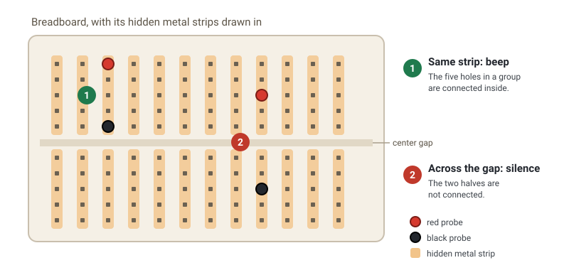

This section shows how to learn by taking things apart: tracing a circuit, turning a compiled program back into something you can read, and watching the messages a device sends.

**Reverse engineering** means working backward from a finished thing to figure out how it works. For many engineers, it's the best way to learn. Instead of only reading about circuits, compilers, and networks, you look at real wires, real machine code, and real packets, and see the ideas from the other sections in action. Three tools cover most of it, one for each of those sections: a **multimeter** for circuits, **Ghidra** for compiled programs, and **Wireshark** for network traffic.

## Ground rules

Taking things apart comes with responsibilities:

- **Only examine what you own or have permission to examine:** your own devices, your own network, your own programs, or ones a mentor has cleared for the project.
- **Network captures can contain other people's private data.** Capture only on networks you control, and don't share capture files without checking what's in them.
- **Only probe low-voltage circuits,** like ones powered by USB or small batteries. Never probe wall outlets, or anything you aren't absolutely sure is safe, without a mentor.
- **Some software licenses and laws restrict reverse engineering.** If you're not sure, ask before you start.

## Running the toolchain backward

In [Programming Fundamentals](/programming-fundamentals/), tools turned source code into machine code. Reverse engineering runs that chain the other way:

```text
building                    reverse engineering

source code (C)    ◀────────  decompiler: a best guess at C
  │ compiler                     ▲
  ▼                              │
assembly           ◀────────  disassembler: exact
  │ assembler + linker           ▲
  ▼                              │
machine code   ──────────────────┘  what's actually stored on the chip
```

Going down loses information. Variable names, comments, and the original structure are gone from the machine code, so a decompiler's output is readable but not the original. Recovering the meaning is the puzzle.

Hardware works the same way. A finished circuit board is the end of a design, and probing it with a multimeter lets you redraw the plan: which pin connects to which part.

Network traffic is similar: it's just bytes on a wire. Wireshark knows thousands of protocols, so it can decode those bytes back into readable fields.

In terms of the [four resources](/embedded-systems/): the multimeter looks at the wires behind **network / IO**, Ghidra looks at what's in **storage**, and Wireshark looks at the **network**.

## Trace a circuit with a multimeter

[Embedded Systems](/embedded-systems/) started with hardware, so we will too. A **multimeter** measures electricity: voltage, resistance, current, and, most useful for taking things apart, **continuity**. In continuity mode, the meter beeps when there's an electrical path between its two probes. That's how you find out which pin connects to what on a board you didn't design.

Continuity mode sends its own small current through the circuit, so **only use it with the power off**. On a powered circuit, the readings are wrong and you can damage the meter.

A breadboard is a good first thing to trace, because it hides metal strips inside that connect some holes and not others:



1. Plug the black probe into the jack marked **COM**, and the red probe into the one marked **V** (often **VΩ** or **VΩmA**).
2. Turn the dial to continuity. Its symbol looks like sound waves, `)))`. On some meters it shares a spot on the dial with resistance (**Ω**), and you press a button to switch.
3. Touch the probe tips together. The meter beeps: that's what "connected" sounds like.
4. Push two jumper wires into the same group of five holes on an empty breadboard, and touch one probe to each wire. Beep: those holes are connected inside.
5. Move one wire across the center gap and try again. Silence: the two halves aren't connected.

Now try a real circuit, like the button and LED from [Embedded Systems](/embedded-systems/), with the USB cable unplugged. Find which board pin connects to the LED. Then hold the probes on the button's two legs and press it: you'll hear the button close the circuit.

Once you know what's connected, switch the dial to DC voltage (**V** with a straight line over it) to see what's powered. Plug the board back in, touch the black probe to **GND** and the red probe to the pin that drives the LED, and press the button. The reading jumps between about 0 V and 3.3 V (or 5 V, depending on the board). That's a single bit, a 0 or a 1, as a voltage on a wire. Probe carefully, so the tip never touches two pins at once.

A multimeter shows one slow-changing number, but digital signals switch thousands or millions of times a second. When you need to see them, an **oscilloscope** draws voltage over time, and a **logic analyzer** records many pins at once and can decode the messages on them. Those can wait until you need them.

## Read a compiled program with Ghidra

Ghidra is a free, open-source reverse engineering tool from the NSA. It takes machine code and shows it as assembly (disassembly) and as approximate C (decompilation).

It's easiest to start with a program you wrote yourself, so you can compare Ghidra's version with the original. Save this as `secret.c`:

```c
// secret.c: a tiny password checker to take apart
#include <stdio.h>
#include <string.h>

int main(int argc, char *argv[]) {
  if (argc > 1 && strcmp(argv[1], "ecolibrium") == 0) {
    printf("Access granted\n");
  } else {
    printf("Wrong password\n");
  }
  return 0;
}
```

Compile and run it:

```sh
gcc -O0 -o secret secret.c    # compile with no optimizations, so it's easier to read
./secret hello                # prints: Wrong password
./secret ecolibrium           # prints: Access granted
```

On macOS, run `xcode-select --install` first to get a compiler. On Windows, the easiest route is to use WSL (Windows Subsystem for Linux).

Before opening Ghidra, try the simplest reverse engineering tool there is:

```sh
strings secret                # print every piece of readable text in the file
```

The password is right there in the list. Anything written into a program as plain text ends up stored in the machine code.

Now open it in Ghidra:

1. Install Ghidra by following its official [Getting Started guide](https://github.com/NationalSecurityAgency/ghidra/blob/master/GhidraDocs/GettingStarted.md). It needs a Java JDK, and the guide lists the current version.
2. Start Ghidra. Choose **File → New Project**, pick **Non-Shared Project**, and give it a folder and a name.
3. Choose **File → Import File** and select `secret`. Accept the defaults.
4. Double-click `secret` to open it. When Ghidra asks to analyze it, click **Yes** and accept the defaults.
5. In the **Symbol Tree** panel, open **Functions** and click `main` (on macOS it's called `_main`).
6. The **Decompile** panel shows Ghidra's version of the C code. Find the `strcmp` call and the `"ecolibrium"` string, and compare them with your original. What survived? What's missing?

For a real challenge, remove the function names and try again:

```sh
strip secret                  # delete the names (symbols) from the program
```

Import the stripped `secret` into Ghidra. `main` no longer has its name, so you have to find it some other way. Hint: search for the `"Wrong password"` text with **Search → For Strings**, then follow where it's used. Real firmware usually arrives like this, with no names at all.

## Watch the network with Wireshark

Wireshark captures every packet passing through your computer's network connection and decodes it, layer by layer. Let's watch the DNS lookup from [Networking and the Internet](/networking/) happen.

1. Install Wireshark from [wireshark.org](https://www.wireshark.org/download.html). On Linux, install it from your distribution's package manager, and allow non-root users to capture if it asks.
2. Open Wireshark. Double-click the connection you're using (Wi-Fi or Ethernet). It's the one with a moving activity line next to it.
3. Type `dns` in the filter bar at the top and press Enter. This hides everything except DNS packets.
4. In a terminal, run:

   ```sh
   nslookup google.com 8.8.8.8   # the same lookup from the Networking section
   ```

5. Back in Wireshark, find the new packets: a **query** to `8.8.8.8` asking for `google.com`, and a **response**. Click the response, then expand **Domain Name System** in the middle pane. The address in the answer is the same one `nslookup` printed.
6. Click the red square to stop capturing.

Next, try changing the filter to `tls` and loading a web page. You'll see the connections your browser makes, even though their contents are encrypted.

## Primary sources

- [Wireshark User's Guide](https://www.wireshark.org/docs/wsug_html_chunked/)
- [Ghidra (official repository, NSA)](https://github.com/NationalSecurityAgency/ghidra)
- [Getting Started with Ghidra](https://github.com/NationalSecurityAgency/ghidra/blob/master/GhidraDocs/GettingStarted.md)

## Learn more

- [Embedded Systems](/embedded-systems/): the circuits you trace with a multimeter.
- [Programming Fundamentals](/programming-fundamentals/): the toolchain that Ghidra runs in reverse.
- [Networking and the Internet](/networking/): what the packets in Wireshark mean.
- [SparkFun: How to Use a Multimeter](https://learn.sparkfun.com/tutorials/how-to-use-a-multimeter/all)
- [Adafruit: Multimeters](https://learn.adafruit.com/multimeters)
- [SparkFun: How to Use an Oscilloscope](https://learn.sparkfun.com/tutorials/how-to-use-an-oscilloscope/all)
